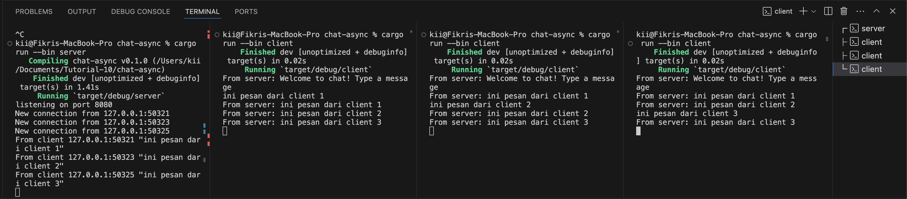

# Tutorial-10: Broadcast Chat 
## Fikri Dhiya Ramadhana
## 2206819533
## AdvProg-C

### Reflection
1. Try to run one server, and three clients.  
  
Dapat dilihat dari gambar di atas, saat menjalankan satu server dengan tiga client, masing masing dari client akan membuat koneksi baru dengan port yang berbeda namun masih terhubung dalam satu server dan hal ini membuat setiap ada pesan yang masuk dari salah satu client akan terhubung ke dalam server dan tampilan client bahwa ada pesan dari client lain.

2. Modifying Port  
  
Untuk mengubah port yang ada diperlukannya untuk mengubah dua file yang berasal dari server.rs dan client.rs
* server.rs  
```rust 
let listener = TcpListener::bind("127.0.0.1:8080").await?;
```
* client.rs  
```rust 
ClientBuilder::from_uri(Uri::from_static("ws://127.0.0.1:8080"))
            .connect()
            .await?;
```
Kedua kode di atas sudah menggunakan protokol WebSocket yang sama yaitu `tokio_websockets` (digunakan pada client side) yang dimana akan membuat server side dan client side berjalan dengan normal walaupun menggunakan port yang berbeda. 